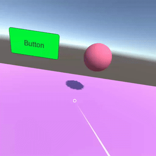

# Unity Oculus Go/GearVR Laser Pointer

This project implements a laser pointer for Oculus Go and GearVR headsets. It is based on [VR with Andrew](https://www.youtube.com/channel/UCG8bDPqp3jykCGbx-CiL7VQ) laser pointer series.

## Installation

### Importing Unity Project
1. Just add this project to Unity Hub.

### Creating a new Unity Project
1. To create a unity VR project, first check out this [Oculus Unity Getting Started Guide](https://developer.oculus.com/documentation/unity/book-unity-gsg/).

### Adding a Pointer to Unity VR Project
1. Install the Oculus Android Package from the package manager.

2. Import at least the VR folder from the Oculus Integration Package from Unity Asset Store.

3. Import our custom Asset Package.

4. Import the Unity Asset Package `oculus-laser-pointer.unitypackage` located on [Releases](https://github.com/balataca/oculus-laser-pointer/releases).

## Usage

1. Open the example scene from `Assets/Examples/Scenes/PointerExample.unity`.
2. Build and Run on your device.